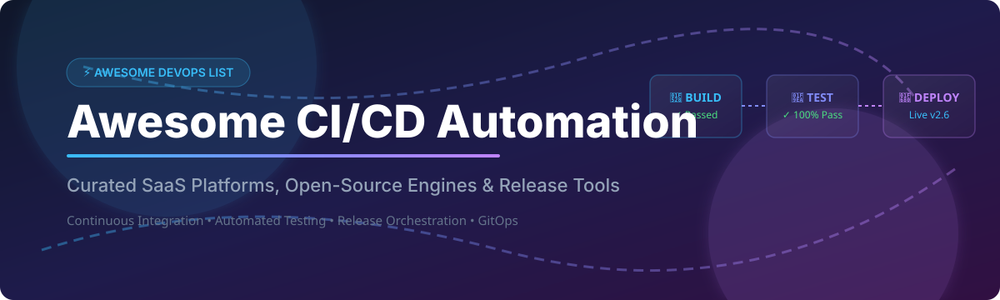

# ⚡ Awesome CI/CD Automation 🚀

  

  
  
  
  
  

---

## 📌 Overview & Introduction

**Curated List of SaaS Products & Open-Source GitHub Projects**
*Focused on Build Pipelines, Continuous Integration (CI), Continuous Deployment (CD) Automation & Release Orchestration*

📅 **Last updated: October 2026**

This repository tracks top **SaaS platforms** and **open-source engines** for **CI/CD Automation**. These DevOps tools help engineering teams automate building, testing, security scanning, and deploying software — enabling faster, more reliable continuous delivery and GitOps workflows.

Whether you need a fully managed cloud solution like **GitHub Actions**, **GitLab CI/CD**, or **Azure Pipelines**, or self-hosted enterprise orchestration like **Jenkins**, **Argo Workflows**, or **Dagger**, this guide offers a comprehensive comparison of pricing, free limits, company revenue/valuation, and star popularity.

---

## 📖 Table of Contents

- [☁️ SaaS / Hosted CI/CD Platforms](#-saas--hosted-cicd-platforms)
- [🔓 Open-Source CI/CD GitHub Projects](#-open-source-cicd-github-projects)
- [🤝 How to Contribute](#-how-to-contribute)
- [☕ Support & Sponsorship](#-support--sponsorship)
- [⭐ Star History](#-star-history)
- [⚠️ Disclaimer](#-disclaimer)

---

## ☁️ SaaS / Hosted CI/CD Platforms

> **📊 Market Context**: The global CI/CD tools and pipeline automation market is estimated at **~$11.85B in 2026**, growing at a **14.12% CAGR** toward **$22.92B by 2031**. The sector is **moderately fragmented** — Jenkins holds a large share of self-hosted deployments, while cloud giants like Microsoft (GitHub Actions / Azure DevOps) and GitLab command massive enterprise segments alongside specialized providers like CircleCI and Buildkite. No single vendor holds a winner-take-all monopoly; enterprise teams predominantly adopt hybrid and multi-vendor delivery stacks.

| Platform | Description | Pricing (Starting Paid Tier) | Free Tier / Trial Limits | Company Size (Valuation / Revenue) |
| :--- | :--- | :--- | :--- | :--- |
| **[Azure Pipelines](https://azure.microsoft.com/en-us/products/devops/pipelines/)** 🔷 | Microsoft's enterprise CI/CD platform integrated with Azure DevOps and cloud services. | **$40/month** per additional Microsoft-hosted parallel job ($15/month for self-hosted job). | **1 Microsoft-hosted job** (1,800 min/month) + **1 self-hosted job** (unlimited mins). Open-source gets 10 free parallel jobs. | **~$331.8B revenue** (Microsoft FY2026) |
| **[GitHub Actions](https://github.com/features/actions)** 🐙 | Native CI/CD engine built into GitHub with over 6,000 marketplace actions. | **$0.006/min** (Linux 2-core standard runner), $0.010/min (Windows 2-core), $0.062/min (macOS). | **Public repos: Unlimited free**. Private repos: 2,000 min/month (Free account), 3,000 min/month (Pro). | **~$331.8B revenue** (Parent Microsoft FY2026) |
| **[GitLab CI/CD](https://about.gitlab.com/)** 🦊 | Complete DevOps & DevSecOps platform with built-in CI/CD pipelines and security scanning. | **$29/user/month** (Premium tier, billed annually); $99/user/month (Ultimate). | **400 compute minutes/month**, 5 users per group, 10 GiB storage. Open source projects get 50,000 compute min/month. | **$955M revenue** (FY2026) |
| **[CircleCI](https://circleci.com/)** ⭕ | High-performance cloud CI/CD platform known for advanced caching and parallel test runner. | **$15/month** (Performance plan base starting credit package). | **30,000 credits/month** (approx. 6,000 build mins), up to 5 users, 30 concurrent Docker builds. | **~$1.7B valuation** ($312.5M total funding) |
| **[TeamCity](https://www.jetbrains.com/teamcity/)** 🏗️ | JetBrains' powerful build management server with deep IDE integrations. | **$17.60/committer/month** (Cloud, min 3 committers) or $2,800/year (On-Premises Enterprise). | **Professional On-Prem: Free forever** (unlimited users, 3 build agents, 100 configurations). Cloud has 14-day free trial. | **~$500M+ revenue** (JetBrains annual est.) |
| **[Bitrise](https://www.bitrise.io/)** 📱 | Mobile DevOps & CI/CD platform optimized for iOS, Android, React Native, and Flutter applications. | **$36/month** (Developer plan starting tier); $229/month (Team plan). | **Hobby Plan: Free forever** for personal projects (30 builds/month, 1 concurrency). 30-day free trial for paid tiers. | **~$100M+ valuation** ($60M+ total funding raised) |
| **[Buildkite](https://buildkite.com/)** 🪁 | Hybrid CI/CD runner architecture — run build agents on your own infra while managing UI in cloud. | **$30/active-user/month** (Pro plan, includes 2,000 Linux vCPU-mins & 250 managed tests). | **Free plan**: 1 user, 3 concurrent jobs, 1 self-hosted agent, 90-day retention. Includes 30-day All Access trial. | **~$70M+ valuation** (Series B funding raised) |
| **[Travis CI](https://travis-ci.com/)** 👷 | Pioneer cloud CI/CD service for GitHub and Bitbucket repository automation. | **$15/month** (Usage-based starting plan with 35,000 build credits, 80 concurrent jobs). | **10,000 build credits one-time allotment** for trial. Open source repos receive free credit top-ups upon request. | **Private** (Acquired by Idera Software) |

---

## 🔓 Open-Source CI/CD GitHub Projects

Below is a curated list of top production-ready open-source continuous integration and delivery engines. 

*Sorted by GitHub Star Count (descending).*

| Repository | Description | Stars |
| :--- | :--- | :--- |
| **[Drone CI](https://github.com/drone/drone)** 🚁 | Lightweight container-native CI/CD server written in Go with easy YAML pipeline definitions. |  |
| **[Jenkins](https://github.com/jenkinsci/jenkins)** 🎷 | The most widely deployed open-source automation server with 1,800+ plugins for any ecosystem. |  |
| **[Argo Workflows](https://github.com/argoproj/argo-workflows)** 🐙 | CNCF graduated Kubernetes-native workflow engine for orchestrating parallel jobs and pipelines. |  |
| **[Dagger](https://github.com/dagger/dagger)** 🗡️ | Programmable CI/CD engine that runs pipelines in containers; executable locally and in any CI provider. |  |
| **[Tekton Pipelines](https://github.com/tektoncd/pipeline)** 🧱 | Powerful Kubernetes-native CI/CD framework for building custom cloud-native delivery platforms. |  |
| **[Concourse CI](https://github.com/concourse/concourse)** 🛰️ | Real-time pipeline-based CI system with explicit resource dependencies and interactive UI. |  |
| **[GoCD](https://github.com/gocd/gocd)** 🏁 | Open-source continuous delivery server specializing in complex dependency modeling and value stream mapping. |  |
| **[Woodpecker CI](https://github.com/woodpecker-ci/woodpecker)** 🐤 | Community-driven fork of Drone CI; lightweight, container-based, and supports multiple Git forges. |  |
| **[Earthly](https://github.com/earthly/earthly)** 🌎 | Supercharged syntax combining Dockerfile and Makefile for reproducible, containerized builds. |  |
| **[Act](https://github.com/nektos/act)** 🎭 | Run your GitHub Actions workflows locally inside Docker containers for rapid testing. |  |
| **[Agola](https://github.com/agola-io/agola)** ⚡ | Modern self-hosted CI/CD engine supporting microservices, container execution, and Kubernetes. |  |
| **[Kraken CI](https://github.com/kraken-ci/kraken)** 🐙 | Scalable open-source test execution and CI platform using Python/Starlark pipeline configuration. |  |

---

## 🤝 How to Contribute

Contributions are very welcome! To add or update an entry:

1. 🍴 **Fork** the repository.
2. 📝 Edit `README.md` following the exact table structure.
3. 🚀 Ensure links, pricing, free tier details, and star badges are accurate.
4. 📬 Submit a **Pull Request** with a brief summary of additions.

Please review the [Awesome List Guidelines](https://github.com/ishandutta2007/Awesome-Awesome-Awesome) before submitting.

---

## ☕ Support & Sponsorship

If you find this repository useful for your DevOps workflows or tool evaluations, please consider supporting the project:

- ⭐ **Star** this repository to show your appreciation!
- 🔀 **Fork** and share it with your team and colleagues.
- 💖 **Sponsor** the maintainer via GitHub Sponsors:  
  

Thank you for helping us keep this list open, accurate, and up to date! 🙌

---

## ⭐ Star History

---

## ⚠️ Disclaimer

- This is a **community-curated reference list** — it is not exhaustive and does not constitute an endorsement.
- CI/CD systems process sensitive code, credentials, and deployment tokens; ensure strict secret management and security controls.
- **Open-Source Viability**: The open-source CI/CD ecosystem is exceptionally mature and production-ready. Projects like **Jenkins**, **Argo Workflows**, **Drone**, and **Dagger** offer enterprise-grade capabilities for organizations requiring self-hosted or air-gapped infrastructure.

---

  <b>Made with ❤️ for DevOps Engineers, SREs, Platform Teams, and Software Developers worldwide.</b>

